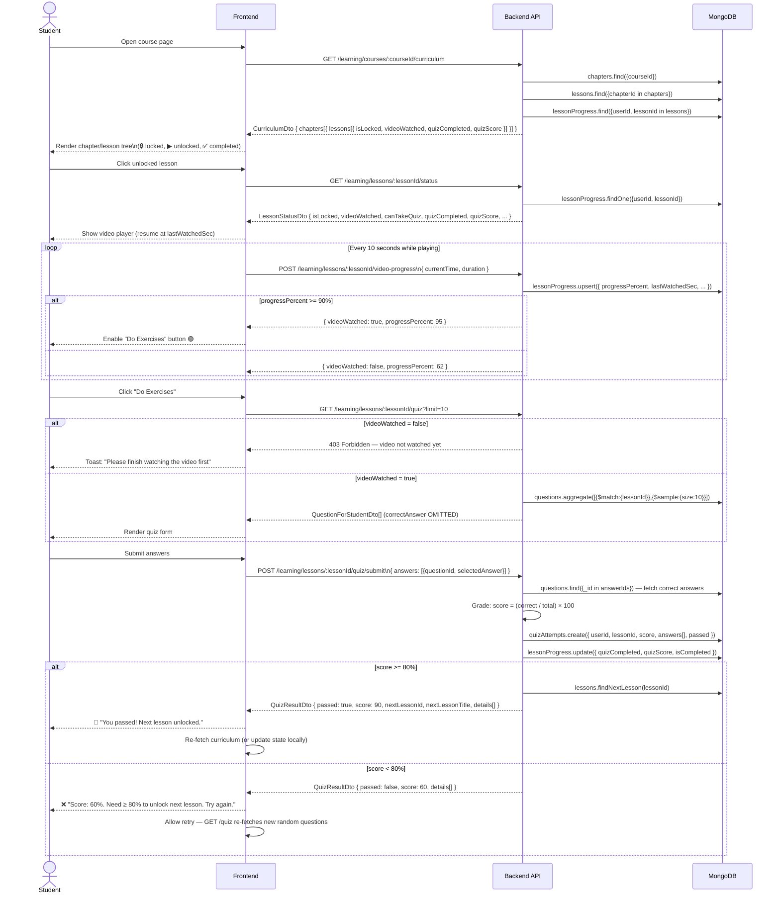

# Student Learning Flow — API Reference

> **Role**: `STUDENT` only  
> **Auth**: Bearer JWT (`Authorization: Bearer <token>`)  
> **Base path**: `/learning`  
> **Pass threshold**: ≥ 80%  
> **Video watched threshold**: ≥ 90% playtime (or `completed: true`)

---

## API Endpoints

| #   | Method | Route                                        | Body                      | Description                                             |
| --- | ------ | -------------------------------------------- | ------------------------- | ------------------------------------------------------- |
| 1   | `GET`  | `/learning/courses/:courseId/curriculum`     | —                         | Step 1 — Chapter → Lesson tree with lock/progress state |
| 2   | `GET`  | `/learning/lessons/:lessonId/status`         | —                         | Full progress snapshot for a single lesson              |
| 3   | `POST` | `/learning/lessons/:lessonId/video-progress` | `VideoProgressRequestDto` | Step 2 — Track video playback                           |
| 4   | `GET`  | `/learning/lessons/:lessonId/quiz?limit=10`  | —                         | Step 3 — Fetch quiz questions (no answers)              |
| 5   | `POST` | `/learning/lessons/:lessonId/quiz/submit`    | `QuizSubmitDto`           | Step 4 — Grade quiz, unlock next lesson                 |

---

## Full Sequence Diagram



---

## Request & Response Schemas

### `GET /learning/courses/:courseId/curriculum` → `CurriculumDto`

```json
{
  "courseId": "64f1...",
  "courseName": "Advanced JavaScript",
  "chapters": [
    {
      "chapterId": "64f2...",
      "title": "Chapter 1: Basics",
      "orderIndex": 1,
      "lessons": [
        {
          "lessonId": "64f3...",
          "title": "Variables & Types",
          "orderIndex": 1,
          "duration": 1200,
          "isLocked": false,
          "videoWatched": true,
          "quizCompleted": true,
          "quizScore": 90,
          "isCompleted": true
        },
        {
          "lessonId": "64f4...",
          "title": "Functions",
          "orderIndex": 2,
          "duration": 900,
          "isLocked": false,
          "videoWatched": false,
          "quizCompleted": false,
          "quizScore": null,
          "isCompleted": false
        }
      ]
    }
  ]
}
```

---

### `POST /learning/lessons/:lessonId/video-progress` — `VideoProgressRequestDto`

```json
{
  "lessonId": "64f3...",
  "currentTime": 1140,
  "duration": 1200,
  "completed": false
}
```

**Response:**

```json
{
  "videoWatched": true,
  "progressPercent": 95
}
```

---

### `GET /learning/lessons/:lessonId/quiz` → `QuestionForStudentDto[]`

```json
[
  {
    "id": "64f5...",
    "questionText": "What keyword declares a block-scoped variable?",
    "options": ["var", "let", "func", "def"],
    "difficulty": "EASY",
    "type": "MULTIPLE_CHOICE"
  }
]
```

> ⚠️ `correctAnswer` is **never** included in this response.

---

### `POST /learning/lessons/:lessonId/quiz/submit` — `QuizSubmitDto`

```json
{
  "answers": [
    { "questionId": "64f5...", "selectedAnswer": "let" },
    { "questionId": "64f6...", "selectedAnswer": "closure" }
  ]
}
```

**Response** — `QuizResultDto`:

```json
{
  "lessonId": "64f3...",
  "score": 80,
  "passed": true,
  "correctCount": 8,
  "totalCount": 10,
  "nextLessonId": "64f4...",
  "nextLessonTitle": "Functions",
  "details": [
    {
      "questionId": "64f5...",
      "questionText": "What keyword declares a block-scoped variable?",
      "selectedAnswer": "let",
      "correctAnswer": "let",
      "isCorrect": true,
      "explanation": "let is block-scoped and was introduced in ES6."
    }
  ]
}
```

---

## Lock / Unlock Logic

```
Lesson 1 (always unlocked on first access)
    │
    ▼ student completes L1 quiz with score >= 80%
Lesson 2 → unlocked automatically
    │
    ▼ student completes L2 quiz with score >= 80%
Lesson 3 → unlocked automatically
    │
    ...
```

**Rules:**

- The **first lesson** of the first chapter is always accessible (`isLocked = false`)
- Any other lesson is locked unless the **immediately preceding lesson** (by `orderIndex`) has `quizCompleted = true` AND `quizScore >= 80`
- A failed attempt does **not** lock a lesson that was previously unlocked
- Students may **retry** a quiz any number of times — each attempt is saved separately
- The best score is **not** automatically promoted; the `quizScore` on `LessonProgress` reflects the **latest** passing attempt score

---

## Error Responses

| Status             | Scenario                                                      |
| ------------------ | ------------------------------------------------------------- |
| `401 Unauthorized` | Missing or invalid JWT token                                  |
| `403 Forbidden`    | Role is not `STUDENT`, or video not yet watched (quiz access) |
| `404 Not Found`    | Course, lesson, or question ID does not exist                 |
| `400 Bad Request`  | Invalid `questionId` in quiz submission                       |

---

## Frontend Integration Checklist

- [ ] Call `GET /curriculum` on course page load; use `isLocked` to grey-out lessons
- [ ] On lesson open, call `GET /status` to restore video position (`lastWatchedSec`)
- [ ] Poll `POST /video-progress` every 10 s during playback; enable quiz button when response has `videoWatched: true`
- [ ] Before showing quiz, check `canTakeQuiz` from `GET /status` (fallback guard)
- [ ] On quiz completion, update local curriculum state using `nextLessonId` from submit response
- [ ] Allow retry immediately — re-fetch `GET /quiz` for a new random question set

---

_Last updated: auto-generated after sequential-learning module implementation_
