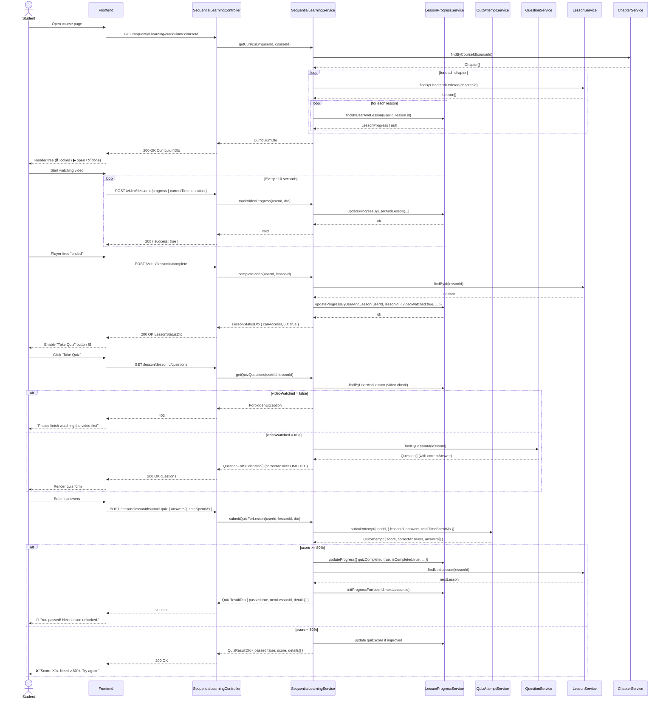
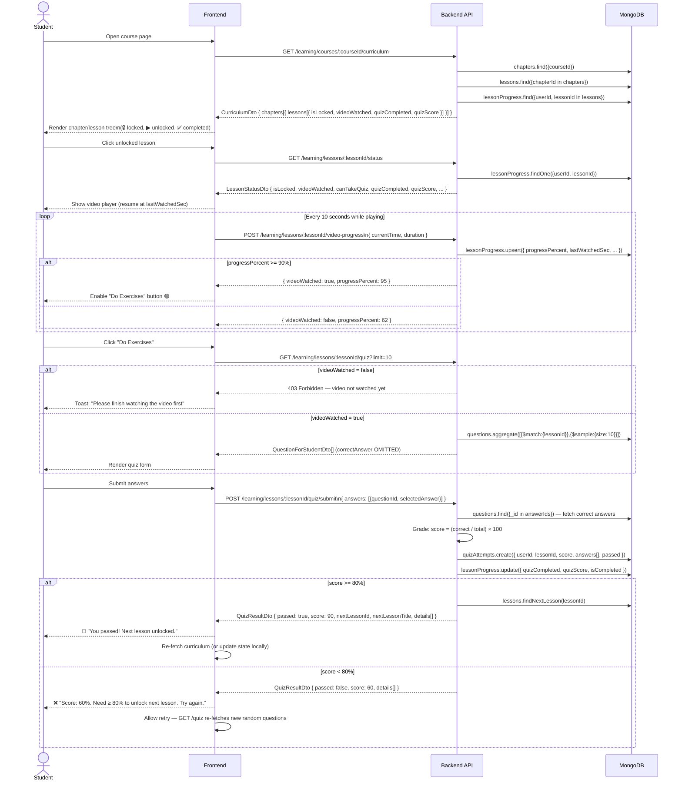

# Core Learning Flow — API Workflow Documentation

> **Version:** 2.0  
> **Module:** `SequentialLearningModule`  
> **Base URL:** `/sequential-learning`  
> **Auth:** All endpoints require `Authorization: Bearer <JWT>`  
> **Pass threshold:** ≥ 80 %  
> **Video watch threshold:** ≥ 90 % playtime OR explicit `complete` event

---

## Overview

The Core Learning Flow enforces a strict **video-first, quiz-second** progression:

```
Course
 └── Chapter 1
      ├── Lesson 1  ✅ (always unlocked)
      ├── Lesson 2  🔒 (unlocked after Lesson 1 passes)
      └── Lesson 3  🔒 (unlocked after Lesson 2 passes)
 └── Chapter 2
      └── ...
```

A lesson is **passed** (and the next lesson unlocked) when the student:
1. Watches **≥ 90 %** of the video (or the player fires the "ended" event), AND
2. Scores **≥ 80 %** on the lesson quiz.

---

## Actors

| Actor | Role |
|-------|------|
| **Student** | Authenticated user consuming the course |
| **API Gateway** | NestJS controller (`SequentialLearningController`) |
| **SequentialLearningService** | Orchestrator — enforces all business rules |
| **LessonProgressService** | Persistent store for per-student lesson state |
| **QuizAttemptService** | Server-side quiz grading engine |
| **QuestionService** | Source of quiz questions (strips `correctAnswer` before delivery) |
| **LessonService** | Lesson metadata + prev/next lesson navigation |
| **ChapterService** | Chapters ordered by `orderIndex` |

---

## Complete Endpoint Reference

| Method | Path | Description |
|--------|------|-------------|
| `GET` | `/sequential-learning/curriculum/:courseId` | **Step 1** — Course tree with lock status |
| `POST` | `/sequential-learning/video/:lessonId/progress` | **Step 2a** — Heartbeat video progress |
| `POST` | `/sequential-learning/video/:lessonId/complete` | **Step 2b** — Explicitly mark video done |
| `GET` | `/sequential-learning/lesson/:lessonId/questions` | **Step 3a** — Quiz questions (no answers) |
| `POST` | `/sequential-learning/lesson/:lessonId/submit-quiz` | **Step 3b** — Submit & grade quiz |
| `GET` | `/sequential-learning/lesson/:lessonId/status` | Full lesson status |
| `GET` | `/sequential-learning/lesson/:lessonId/quiz-access` | Lightweight quiz-gate check |

---

## Step 1 — Display Curriculum Tree

**Endpoint:** `GET /sequential-learning/curriculum/:courseId`

### Goal
Show the student a hierarchical view of the course with lock/progress status on each lesson.

### Sequence

```
Student → API: GET /sequential-learning/curriculum/:courseId
API → SequentialLearningService: getCurriculum(userId, courseId)

  SequentialLearningService → ChapterService: findByCourseId(courseId)
  ChapterService → SequentialLearningService: Chapter[]

  for each Chapter:
    SequentialLearningService → LessonService: findByChapterIdOrdered(chapter.id)
    LessonService → SequentialLearningService: Lesson[]

    for each Lesson[i]:
      SequentialLearningService → LessonProgressService: findByUserAndLesson(userId, lesson.id)
      LessonProgressService → SequentialLearningService: LessonProgress | null

      [if i > 0]:
        SequentialLearningService → _isLocked(userId, lessons[i-1].id)
          → checks: prevProgress.videoWatched AND (no quiz OR quizCompleted AND quizScore >= 80)

SequentialLearningService → API: CurriculumDto
API → Student: 200 OK CurriculumDto
```

### Response Shape (`CurriculumDto`)

```json
{
  "courseId": "64f1a2b3c4d5e6f7a8b9c0d1",
  "totalLessons": 10,
  "completedLessons": 3,
  "overallProgressPercent": 30,
  "chapters": [
    {
      "id": "64f1...",
      "title": "Introduction",
      "orderIndex": 1,
      "totalLessons": 3,
      "completedLessons": 1,
      "lessons": [
        {
          "id": "64f3...",
          "title": "What is NestJS?",
          "orderIndex": 1,
          "durationSeconds": 600,
          "isPreview": false,
          "isLocked": false,
          "videoWatched": true,
          "quizCompleted": true,
          "quizScore": 90,
          "isCompleted": true
        },
        {
          "id": "64f4...",
          "title": "Modules & Providers",
          "orderIndex": 2,
          "durationSeconds": 480,
          "isLocked": false,
          "videoWatched": false,
          "quizCompleted": false,
          "quizScore": null,
          "isCompleted": false
        },
        {
          "id": "64f5...",
          "title": "Guards & Interceptors",
          "orderIndex": 3,
          "durationSeconds": 720,
          "isLocked": true,
          "videoWatched": false,
          "quizCompleted": false,
          "quizScore": null,
          "isCompleted": false
        }
      ]
    }
  ]
}
```

### Lock Logic

| Condition | `isLocked` |
|-----------|-----------|
| First lesson of the course | `false` — always open |
| Previous lesson: video not yet watched | `true` |
| Previous lesson: no quiz questions exist | `false` — video alone unlocks |
| Previous lesson: quiz not completed OR score < 80 % | `true` |
| Previous lesson: quiz passed (score ≥ 80 %) | `false` |

---

## Step 2a — Watch Video (Heartbeat Progress)

**Endpoint:** `POST /sequential-learning/video/:lessonId/progress`

### Goal
Persist the student's watch position periodically (e.g. every 10 seconds).  
Auto-marks `videoWatched = true` once ≥ 90 % is reached.

### Request Body (`VideoProgressRequestDto`)

```json
{
  "currentTime": 543,
  "duration": 600,
  "completed": false
}
```

> `lessonId` comes from the URL path parameter, not the body.

### Sequence

```
Student (player heartbeat) → API: POST /sequential-learning/video/:lessonId/progress
API → SequentialLearningService: trackVideoProgress(userId, dto)

  progressPercent = min(round(currentTime / duration × 100), 100)
  videoWatched    = completed OR (currentTime / duration ≥ 0.90)

  SequentialLearningService → LessonProgressService:
    updateProgressByUserAndLesson(userId, lessonId, {
      progressPercent, videoWatched,
      videoCurrentTime: currentTime,
      videoDuration: duration,
      lastWatchedAt: now()
    })

API → Student: 200 OK { success: true }
```

---

## Step 2b — Complete Video (Explicit Signal)

**Endpoint:** `POST /sequential-learning/video/:lessonId/complete`

### Goal
Explicitly mark the video as watched when the player fires its `ended` event or the student clicks "Mark as watched".  
Returns `LessonStatusDto` with `canAccessQuiz: true` so the UI can immediately enable the **"Take Quiz"** button.

### Sequence

```
Student (player "ended") → API: POST /sequential-learning/video/:lessonId/complete
API → SequentialLearningService: completeVideo(userId, lessonId)

  SequentialLearningService → LessonService: findById(lessonId)
  → throws 404 if not found

  SequentialLearningService → LessonProgressService:
    updateProgressByUserAndLesson(userId, lessonId, {
      videoWatched: true,
      videoCurrentTime: lesson.video.durationSeconds,
      videoDuration: lesson.video.durationSeconds,
      lastWatchedAt: now()
    })

  SequentialLearningService → (self): getLessonStatus(userId, lessonId)

API → Student: 200 OK LessonStatusDto { canAccessQuiz: true, ... }
```

### Response (`LessonStatusDto`)

```json
{
  "lessonId": "64f3...",
  "videoWatched": true,
  "videoCurrentTime": 600,
  "videoDuration": 600,
  "progressPercent": 50,
  "canAccessQuiz": true,
  "quizCompleted": false,
  "quizScore": null,
  "isCompleted": false,
  "isLocked": false
}
```

---

## Step 3a — Fetch Quiz Questions

**Endpoint:** `GET /sequential-learning/lesson/:lessonId/questions`

### Goal
Return quiz questions **without** `correctAnswer` — grading is always server-side.  
Returns **403** if the student hasn't finished the video yet.

### Sequence

```
Student → API: GET /sequential-learning/lesson/:lessonId/questions
API → SequentialLearningService: getQuizQuestions(userId, lessonId)

  SequentialLearningService → canAccessQuiz(userId, lessonId)
    → LessonProgressService.findByUserAndLesson(userId, lessonId)
    → returns progress.videoWatched

  [if !videoWatched] → 403 Forbidden

  SequentialLearningService → QuestionService: findByLessonId(lessonId)
  [if questions.length === 0] → 404 Not Found

  map Question[] → QuestionForStudentDto[]
    (correctAnswer intentionally OMITTED)

API → Student: 200 OK QuestionForStudentDto[]
```

### Response (`QuestionForStudentDto[]`)

```json
[
  {
    "id": "64f5...",
    "contentHtml": "<p>What decorator makes a class injectable in NestJS?</p>",
    "type": "MULTIPLE_CHOICE",
    "difficulty": "EASY",
    "options": ["@Module()", "@Injectable()", "@Controller()", "@Guard()"]
  }
]
```

> ⚠️ `correctAnswer` is **never** included — grading happens on the server.

---

## Step 3b — Submit Quiz Answers

**Endpoint:** `POST /sequential-learning/lesson/:lessonId/submit-quiz`

### Goal
Submit answers → server grades → update progress → return result with `nextLessonId` if passed.

### Request Body (`QuizSubmitDto`)

```json
{
  "answers": [
    { "questionId": "64f5...", "selectedAnswer": "@Injectable()" },
    { "questionId": "64f6...", "selectedAnswer": "0" }
  ],
  "timeSpentMs": 45000
}
```

### Sequence

```
Student → API: POST /sequential-learning/lesson/:lessonId/submit-quiz
API → SequentialLearningService: submitQuizForLesson(userId, lessonId, dto)

  [1] Access gate
  SequentialLearningService → canAccessQuiz(userId, lessonId)
  → [if !videoWatched] → 403 Forbidden

  [2] Validate
  SequentialLearningService → LessonService: findById(lessonId)       → 404 if missing
  SequentialLearningService → QuestionService: findByLessonId(lessonId) → 400 if empty

  [3] Server-side grading
  SequentialLearningService → QuizAttemptService: submitAttempt(userId, {
    lessonId, answers, totalTimeSpentMs: dto.timeSpentMs
  })
  QuizAttemptService → SequentialLearningService: QuizAttempt {
    score, totalQuestions, correctAnswers, answers[]
  }

  [4] Business rule: score >= 80 %?

  ┌── YES (passed) ────────────────────────────────────────────────────┐
  │  LessonProgressService.updateProgressByUserAndLesson(userId, lessonId, {
  │    quizCompleted: true, quizScore: score,
  │    progressPercent: 100, isCompleted: true
  │  })
  │  LessonService.findNextLesson(lessonId)
  │  LessonProgressService.updateProgressByUserAndLesson(userId, nextLesson.id, {})
  │    ↑ Creates a progress record so the next lesson appears in getCurriculum
  └───────────────────────────────────────────────────────────────────┘

  ┌── NO (failed) ─────────────────────────────────────────────────────┐
  │  If score > existing quizScore:
  │    LessonProgressService.updateProgressByUserAndLesson(userId, lessonId, {
  │      quizScore: score
  │    })
  └───────────────────────────────────────────────────────────────────┘

  [5] Build answer details (correctAnswer + explanation exposed post-submission)
  map attempt.answers + questionMap → QuizAnswerDetailDto[]

API → Student: 200 OK QuizResultDto
```

### Response (`QuizResultDto`)

```json
{
  "score": 90,
  "totalQuestions": 10,
  "correctAnswers": 9,
  "passed": true,
  "nextLessonId": "64f4...",
  "nextLessonTitle": "Guards & Interceptors",
  "details": [
    {
      "questionId": "64f5...",
      "correct": true,
      "selectedAnswer": "@Injectable()",
      "correctAnswer": "@Injectable()",
      "explanation": "The @Injectable() decorator marks a class as a NestJS provider..."
    },
    {
      "questionId": "64f6...",
      "correct": false,
      "selectedAnswer": "0",
      "correctAnswer": "1",
      "explanation": "Array index 1 is correct because..."
    }
  ]
}
```

### Business Rules

| Rule | Value |
|------|-------|
| Pass threshold | **≥ 80 %** |
| Video watch threshold | **≥ 90 %** playback OR explicit `/complete` call |
| Score persistence | Best score is retained if new score is higher |
| Correct answer exposure | **ONLY** revealed in `details[]` after submission |
| Next lesson auto-init | Progress record created so lesson appears in curriculum tree |
| Retry policy | Unlimited retries; each attempt is stored separately |

---

## Supplementary Endpoints

### `GET /sequential-learning/lesson/:lessonId/status`

Returns full lesson state at any point — use this on lesson page load to restore the UI.

```json
{
  "lessonId": "64f3...",
  "videoWatched": true,
  "videoCurrentTime": 540,
  "videoDuration": 600,
  "progressPercent": 90,
  "canAccessQuiz": true,
  "quizCompleted": false,
  "quizScore": null,
  "isCompleted": false,
  "isLocked": false
}
```

### `GET /sequential-learning/lesson/:lessonId/quiz-access`

Lightweight check — returns `{ canAccess: boolean }`.  
Used to conditionally show/hide the quiz button without fetching full status.

```json
{ "canAccess": true }
```

---

## Full Sequence Diagram (Mermaid)



---

## Error Reference

| HTTP Status | Scenario |
|-------------|----------|
| `401 Unauthorized` | Missing or invalid JWT token |
| `403 Forbidden` | Video not yet watched (quiz access denied) |
| `404 Not Found` | Lesson or quiz questions not found |
| `400 Bad Request` | Lesson has no quiz questions configured |

---

## Frontend Integration Guide

### Typical Page Load Flow

```
1. GET /sequential-learning/curriculum/:courseId
   → Render lesson list; use isLocked to show 🔒

2. Student clicks an unlocked lesson:
   GET /sequential-learning/lesson/:lessonId/status
   → Restore player to videoCurrentTime
   → Show/hide quiz button based on canAccessQuiz

3. Player fires timeupdate every 10 s:
   POST /sequential-learning/video/:lessonId/progress
   { currentTime, duration, completed: false }

4. Player fires ended event:
   POST /sequential-learning/video/:lessonId/complete
   → Response has canAccessQuiz: true → enable quiz button

5. Student clicks quiz button:
   GET /sequential-learning/lesson/:lessonId/questions
   → Render quiz form (no correct answers shown)

6. Student submits quiz:
   POST /sequential-learning/lesson/:lessonId/submit-quiz
   → passed: true? Navigate to nextLessonId
   → passed: false? Show retry UI with score + details
```

### Frontend Integration Checklist

- [ ] Call `GET /curriculum` on course page load; use `isLocked` to grey-out lessons
- [ ] On lesson open, call `GET /status` to restore video position (`videoCurrentTime`)
- [ ] POST `/video/:id/progress` every ~10 s during playback
- [ ] POST `/video/:id/complete` on player `ended` event
- [ ] Enable quiz button only when `canAccessQuiz: true`
- [ ] Never display `correctAnswer` before submission; use `QuizAnswerDetailDto.details` from submit response
- [ ] On pass: navigate to `nextLessonId` and re-fetch curriculum

---

## Service Dependency Graph

```
SequentialLearningController
        │
        ▼
SequentialLearningService
  ├── LessonProgressService    ← reads/writes per-student progress flags
  ├── QuizAttemptService       ← grades answers, stores attempt history
  ├── LessonService            ← lesson metadata, prev/next navigation
  ├── QuestionService          ← quiz questions (correctAnswer kept server-side)
  └── ChapterService           ← chapter tree ordered by orderIndex
```

---

*Last updated: auto-generated after SequentialLearningModule implementation (v2.0)*

---

## API Endpoints

| #   | Method | Route                                        | Body                      | Description                                             |
| --- | ------ | -------------------------------------------- | ------------------------- | ------------------------------------------------------- |
| 1   | `GET`  | `/learning/courses/:courseId/curriculum`     | —                         | Step 1 — Chapter → Lesson tree with lock/progress state |
| 2   | `GET`  | `/learning/lessons/:lessonId/status`         | —                         | Full progress snapshot for a single lesson              |
| 3   | `POST` | `/learning/lessons/:lessonId/video-progress` | `VideoProgressRequestDto` | Step 2 — Track video playback                           |
| 4   | `GET`  | `/learning/lessons/:lessonId/quiz?limit=10`  | —                         | Step 3 — Fetch quiz questions (no answers)              |
| 5   | `POST` | `/learning/lessons/:lessonId/quiz/submit`    | `QuizSubmitDto`           | Step 4 — Grade quiz, unlock next lesson                 |

---

## Full Sequence Diagram



---

## Request & Response Schemas

### `GET /learning/courses/:courseId/curriculum` → `CurriculumDto`

```json
{
  "courseId": "64f1...",
  "courseName": "Advanced JavaScript",
  "chapters": [
    {
      "chapterId": "64f2...",
      "title": "Chapter 1: Basics",
      "orderIndex": 1,
      "lessons": [
        {
          "lessonId": "64f3...",
          "title": "Variables & Types",
          "orderIndex": 1,
          "duration": 1200,
          "isLocked": false,
          "videoWatched": true,
          "quizCompleted": true,
          "quizScore": 90,
          "isCompleted": true
        },
        {
          "lessonId": "64f4...",
          "title": "Functions",
          "orderIndex": 2,
          "duration": 900,
          "isLocked": false,
          "videoWatched": false,
          "quizCompleted": false,
          "quizScore": null,
          "isCompleted": false
        }
      ]
    }
  ]
}
```

---

### `POST /learning/lessons/:lessonId/video-progress` — `VideoProgressRequestDto`

```json
{
  "lessonId": "64f3...",
  "currentTime": 1140,
  "duration": 1200,
  "completed": false
}
```

**Response:**

```json
{
  "videoWatched": true,
  "progressPercent": 95
}
```

---

### `GET /learning/lessons/:lessonId/quiz` → `QuestionForStudentDto[]`

```json
[
  {
    "id": "64f5...",
    "questionText": "What keyword declares a block-scoped variable?",
    "options": ["var", "let", "func", "def"],
    "difficulty": "EASY",
    "type": "MULTIPLE_CHOICE"
  }
]
```

> ⚠️ `correctAnswer` is **never** included in this response.

---

### `POST /learning/lessons/:lessonId/quiz/submit` — `QuizSubmitDto`

```json
{
  "answers": [
    { "questionId": "64f5...", "selectedAnswer": "let" },
    { "questionId": "64f6...", "selectedAnswer": "closure" }
  ]
}
```

**Response** — `QuizResultDto`:

```json
{
  "lessonId": "64f3...",
  "score": 80,
  "passed": true,
  "correctCount": 8,
  "totalCount": 10,
  "nextLessonId": "64f4...",
  "nextLessonTitle": "Functions",
  "details": [
    {
      "questionId": "64f5...",
      "questionText": "What keyword declares a block-scoped variable?",
      "selectedAnswer": "let",
      "correctAnswer": "let",
      "isCorrect": true,
      "explanation": "let is block-scoped and was introduced in ES6."
    }
  ]
}
```

---

## Lock / Unlock Logic

```
Lesson 1 (always unlocked on first access)
    │
    ▼ student completes L1 quiz with score >= 80%
Lesson 2 → unlocked automatically
    │
    ▼ student completes L2 quiz with score >= 80%
Lesson 3 → unlocked automatically
    │
    ...
```

**Rules:**

- The **first lesson** of the first chapter is always accessible (`isLocked = false`)
- Any other lesson is locked unless the **immediately preceding lesson** (by `orderIndex`) has `quizCompleted = true` AND `quizScore >= 80`
- A failed attempt does **not** lock a lesson that was previously unlocked
- Students may **retry** a quiz any number of times — each attempt is saved separately
- The best score is **not** automatically promoted; the `quizScore` on `LessonProgress` reflects the **latest** passing attempt score

---

## Error Responses

| Status             | Scenario                                                      |
| ------------------ | ------------------------------------------------------------- |
| `401 Unauthorized` | Missing or invalid JWT token                                  |
| `403 Forbidden`    | Role is not `STUDENT`, or video not yet watched (quiz access) |
| `404 Not Found`    | Course, lesson, or question ID does not exist                 |
| `400 Bad Request`  | Invalid `questionId` in quiz submission                       |

---

## Frontend Integration Checklist

- [ ] Call `GET /curriculum` on course page load; use `isLocked` to grey-out lessons
- [ ] On lesson open, call `GET /status` to restore video position (`lastWatchedSec`)
- [ ] Poll `POST /video-progress` every 10 s during playback; enable quiz button when response has `videoWatched: true`
- [ ] Before showing quiz, check `canTakeQuiz` from `GET /status` (fallback guard)
- [ ] On quiz completion, update local curriculum state using `nextLessonId` from submit response
- [ ] Allow retry immediately — re-fetch `GET /quiz` for a new random question set

---

_Last updated: auto-generated after sequential-learning module implementation_
